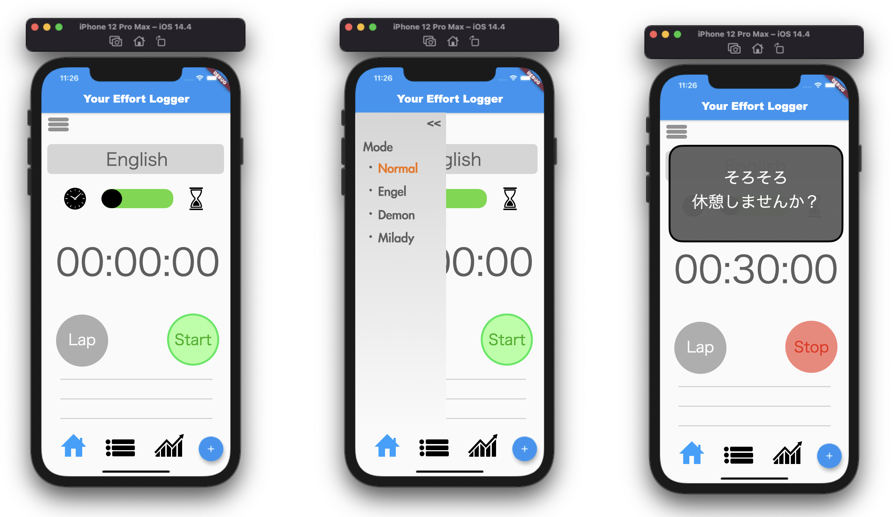

# Idea: Your Effort Logger

- Title : Your Effort Logger
- Outline : 
  - あらゆる項目の努力を数値化してくれるアプリ
  - 勉強時間を科目ごとに記録できたり、アクティビティの時間を記録。
- Minimum fonctions : 
  - Select items. 
  - Add items.
  - Stop watch & Timer func. 
  - Notification func.
  - Categorize func.
- Additional functions : 
  - Some mode select

|Mode|Brief explanation|
|---|---|
| Normal  | Standard mode 
| Engel   | ひたすら褒めてくれるモード 
| Demon   | ひらすらダメ人間になるよう誘惑してくるモード
| Milady  | 休憩を促すが、休憩するとバカにしてくるモード

## App image (draft)

